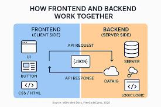
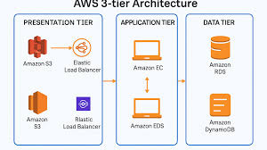

# Web Application Basics – Answers

## Q1. Role of Frontend (FE)

Frontend (FE) is the part of a web application that users can see and interact with. It runs in the browser.

### User Interface
- Frontend is responsible for how the website looks.
- It includes buttons, text, images, forms, colors, and layout.
- Technologies like HTML, CSS, and JavaScript are used to build the UI.

### User Interaction
- Frontend handles user actions like clicking buttons, typing in forms, scrolling, etc.
- It shows instant feedback such as error messages or loading indicators.
- Example: Showing a message when a password is too short.

### Communication with Backend
- Frontend sends requests to the backend to get or save data.
- It uses APIs (usually through HTTP requests).
- Example: Sending login details to the backend and showing the response.

---

## Q2. Role of Backend (BE)

Backend (BE) is the part of the web application that works behind the scenes. Users do not see it directly.

### Server-side Processing
- Backend processes requests sent from the frontend.
- It decides what to do with the data (logic, calculations, validations).
- Example: Checking if login credentials are correct.

### Database Handling
- Backend connects to the database.
- It stores, updates, deletes, and fetches data.
- Example: Saving user details during signup.

### Security and Authentication
- Backend handles authentication and authorization.
- It ensures only valid users can access certain data.
- Example: Checking if a user is logged in before showing their profile.

---

## Q3. Business Logic

Business Logic is the set of rules that decide **how an application behaves** according to real-world requirements.  
It sits between the frontend and the database.

Business logic answers questions like:
- Who can do what?
- When should something happen?
- What rules must be followed?

### Real-world Examples

1. **E-commerce Website**
   - Apply discount only if cart value is above ₹1000.
   - Do not allow checkout if items are out of stock.

2. **Banking Application**
   - Do not allow withdrawal if balance is insufficient.
   - Apply interest only at the end of the month.

3. **Online Exam System**
   - Auto-submit exam when time is over.
   - Prevent students from attempting the exam twice.

---

## Q4. Client–Server Model

The Client–Server Model is a way of organizing how web applications work.

### Who is the Client
- The client is usually the browser or mobile app.
- It sends requests and displays the response.
- Example: Chrome browser requesting a webpage.

### Who is the Server
- The server is a machine or program that processes requests.
- It sends data or results back to the client.
- Example: A backend server running on the cloud.

### How Communication Happens
- Communication happens through HTTP/HTTPS.
- Client sends a request → Server processes it → Server sends a response.
- Example: Client requests user data, server sends JSON response.

---

## Q5. Three-Tier Architecture

3-Tier Architecture divides a web application into three layers.

### Presentation Layer
- This is the frontend.
- It shows data and collects user input.
- Example: Web pages, forms, buttons.

### Application (Business) Layer
- This layer contains business logic.
- It processes requests and applies rules.
- Example: Checking permissions, calculations.

### Data Layer
- This layer handles the database.
- It stores and retrieves data.
- Example: MySQL, MongoDB.

### Why This Architecture is Used
- Easy to manage and maintain.
- Each layer has a clear responsibility.
- Changes in one layer do not affect others much.
- Better scalability and security.

---

## Q6. JavaScript as a Backend Language

JavaScript is used as a backend language mainly with environments like Node.js.

### Performance
- JavaScript is fast because it uses non-blocking, event-driven architecture.
- It handles many requests efficiently.

### Ecosystem
- JavaScript has a huge number of libraries and packages (npm).
- Developers can easily add features without building everything from scratch.

### Popular Backend Frameworks
- **Node.js** – Runtime environment.
- **Express.js** – Simple and lightweight framework.
- **NestJS** – Structured and scalable framework.

### Why Developers Like It
- Same language for frontend and backend.
- Faster development and easier learning curve.

---

