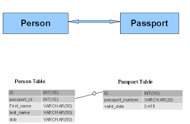
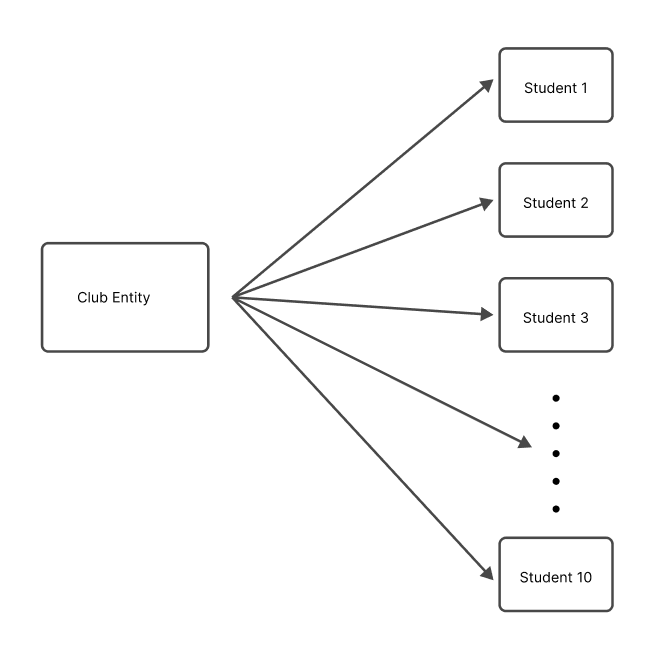

## Database Relationships

## What is a Database Relationship?

A database relationship means how data in one table is connected to data in another table.
Instead of putting everything in one big table, we split data into multiple tables and connect them using relationships.
This helps avoid duplication and keeps data organized.

## Types of Database Relationships
There are mainly three types of database relationships:
One-to-One (1:1)
One-to-Many (1:M)
Many-to-Many (M:M)

1. One-to-One Relationship (1:1)
Explanation:
In a one-to-one relationship, one record in a table is connected to only one record in another table.

E-commerce Example:
User ↔ UserProfile
One user has one profile
One profile belongs to one user

Example tables:
users (user_id, email, password)
user_profiles (profile_id, user_id, address, phone)
Here, user_id is used to connect both tables.

2. One-to-Many Relationship (1:M)
Explanation:
In a one-to-many relationship, one record in a table can be linked to multiple records in another table.

E-commerce Example:
User → Orders
One user can place many orders
Each order belongs to one user

Example tables:
users (user_id, name)
orders (order_id, user_id, order_date)
Here:
One user_id appears many times in the orders table.

3. Many-to-Many Relationship (M:M)
Explanation:
In a many-to-many relationship, multiple records in one table are connected to multiple records in another table.
This usually requires a junction (middle) table.

E-commerce Example:
Products ↔ Orders
One order can have many products
One product can be part of many orders
Example tables:
products (product_id, name, price)
orders (order_id, user_id)
order_items (order_id, product_id, quantity)
The order_items table connects orders and products.

